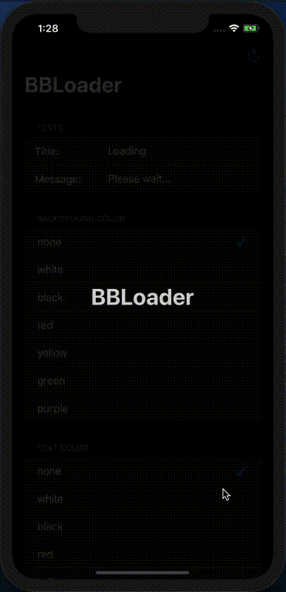
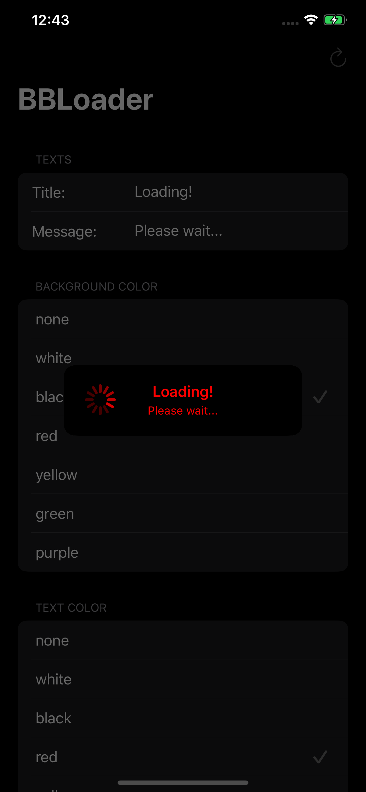
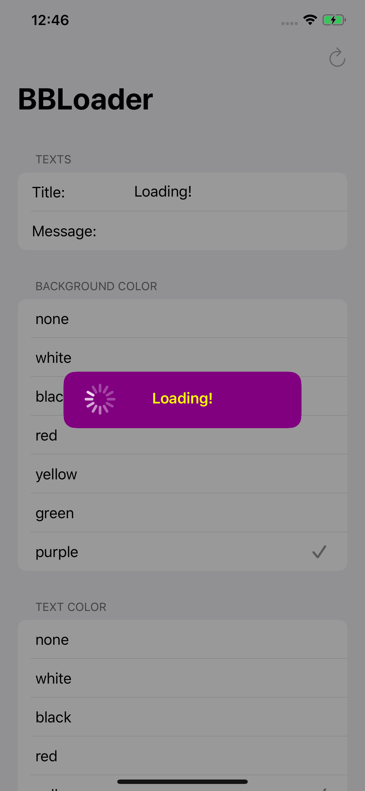

# BBLoader

Make awesome minimal loading animation with text using BBLoader. BBLoader is a light-weight minimal looking loading animation popup build on top of UIKit for iOS and tvOS. This also, disables user interaction while the contents are being loaded asynchronously. Package is compiled using Xcode 11.0 on MacOS 10.15 using Swift 5.2.2 compiler.

## Support


[](https://www.apple.com/in/macos/catalina/)
[](https://developer.apple.com/xcode/)
[](https://developer.apple.com/swift/)

## Code

```swift
import UIKit
import BBLoader

class ViewController: UIViewController {

    override func viewDidLoad() {
        super.viewDidLoad()
        
        presentBBLoader(duration: 30, setup: { loader in
            loader.title                 = "Loading"
            loader.message               = "Please wait..."
            loader.backgroundColor       = .black
            loader.textColor             = .red
            loader.loadingIndicatorColor = .red
        }) { loader in
            URLSession.shared.dataTask(with: URL(string: "https://www.yoururl.com")!) { _,_,_  in
                loader.dismiss()
            }.resume()
        }
    }
}
```

## Screenshots

<table>
  <tr>
    <td>Animation</td>
     <td>Dark mode</td>
     <td>Light mode</td>
  </tr>
  <tr>
    <td></td>
    <td></td>
    <td></td>
  </tr>
 </table>

 ## Installation

 ### Swift Package Manager

The [Swift Package Manager](https://swift.org/package-manager/) is a tool for automating the distribution of Swift code and is integrated into the `swift` compiler. It is in early development, but BBLoader does support its use on supported platforms.

Once you have your Swift package set up, adding BBLoader as a dependency is as easy as adding it to the `dependencies` value of your `Package.swift`.

```swift
dependencies: [
    .package(url: "https://github.com/bibinjacobpulickal/BBLoader.git", .upToNextMajor(from: "1.0.0"))
]
```

## Example

Clone or download the project. Open `.xcodeproj` file using supported Xcode. Change target to iOSExample and run on a device or simulator.

## License

BBLoader is released under the MIT license. [See LICENSE](https://github.com/bibinjacobpulickal/BBLoader/blob/master/LICENSE) for details.
